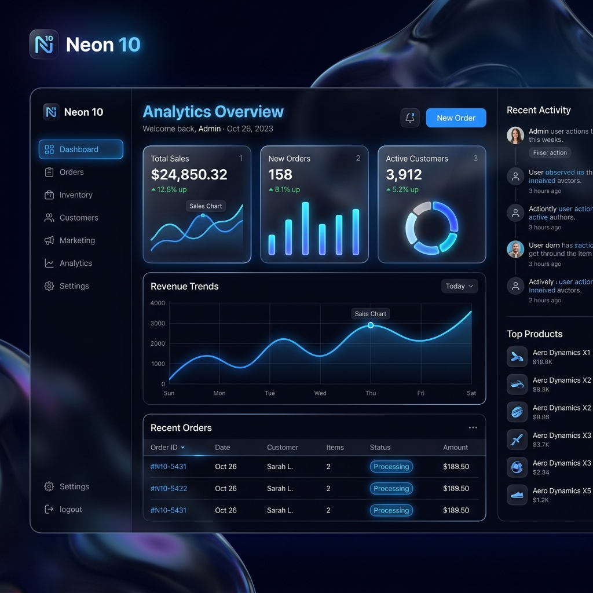

<div align="center">



# 🌟 Neon 10

**The Next Generation Amazon Seller Intelligence Platform**

[](https://nextjs.org/)
[](https://reactjs.org/)
[](https://www.typescriptlang.org/)
[](https://tailwindcss.com/)
[](#)

*Experience the future of e-commerce analytics with a stunning, Apple-inspired liquid glass interface.*

</div>

---

## 🚀 Overview

**Neon 10** is a comprehensive, production-grade demo portal designed to replicate the immense power of industry-standard Amazon seller tools, but completely reimagined through a modern, high-fidelity UI/UX lens. 

Gone are the days of clunky, utilitarian dashboards. Neon 10 brings a **"liquid glass" aesthetic**, featuring seamless Light & Dark modes, vibrant blue accents, frosted glass cards, and fluid animations.

Whether you're an investor, an agency, or a developer looking to build the next big SaaS, Neon 10 provides the perfect frontend blueprint.

---

## ✨ Key Features

Neon 10 comes packed with **22 meticulously crafted tools**, categorized for ultimate seller success:

### 🔍 Product Research
- **Black Box**: Advanced product opportunity filtering & discovery.
- **Xray**: Competitor intelligence tables.
- **Trendster**: Seasonality and BSR trend tracking visualizations.

### 🔑 Keyword Research
- **Cerebro**: Reverse ASIN lookup tool.
- **Magnet**: Keyword aggregator and search volume analytics.
- **Frankenstein**: Massive keyword list processor.
- **Misspellinator**: Discover highly searched, easily ranked misspelled keywords.

### 📝 Listing Optimization
- **Listing Builder**: AI-powered editor with a real-time keyword optimization scoring ring.
- **Scribbles**: Live text tracking with dynamic keyword checklists.
- **Index Checker**: Verify Amazon indexing for specific ASINs.
- **Listing Analyzer**: Comprehensive listing health scoring and visualizations.

### ⚙️ Operations
- **Alerts**: Hijacker and listing suppression monitoring.
- **Follow-Up**: Email automation campaign management.
- **Inventory Management**: Reorder forecasting and stock tracking.
- **Inventory Protector**: Prevent inventory wipeouts from malicious coupon abuse.
- **Refund Genie**: Automated FBA reimbursement tracking.

### 📈 Analytics & Ads
- **Profits Dashboard**: Top-level P&L and revenue tracking with interactive `Recharts`.
- **Keyword Tracker**: Daily rank monitoring with sparkline charts.
- **Market Tracker**: Market share distribution with pie and area charts.
- **Ads (Adtomic)**: PPC management, bid optimization, and ROI metrics.

### 🛠️ Utilities
- **URL Builder**: Generator for heavily tagged Amazon super URLs.
- **QR Code Generator**: Fully functional custom QR generator with image export.

---

## 🎨 Design System: "Liquid Glass"

Neon 10 is built on a custom design system that prioritizes aesthetics without sacrificing performance.

*   🌓 **Dynamic Theming**: Powered by `next-themes`, instantly toggle between Light and Dark mode without page reloads.
*   🧊 **Frosted Glass**: Heavy use of `backdrop-filter: blur(24px)` creates a stunning depth effect over dynamic, animated background orbs.
*   🍎 **Apple-Inspired Palette**: Clean typography (Inter font), subtle shadows, and striking blue accents (`#007AFF` / `#0A84FF`) provide a premium, native-app feel in the browser.
*   📊 **Themed Data Visualizations**: All `Recharts` graphs are bound to CSS variables, ensuring they look perfect whether the lights are on or off.

---

## 💻 Tech Stack

- **Framework**: [Next.js 14](https://nextjs.org/) (App Router)
- **Language**: [TypeScript](https://www.typescriptlang.org/)
- **Styling**: Vanilla CSS Variables & custom glassmorphism utilities
- **Icons**: [Lucide React](https://lucide.dev/)
- **Charts**: [Recharts](https://recharts.org/)
- **Theme Management**: `next-themes`

---

## 🛠️ Getting Started

To run Neon 10 locally:

1. **Clone the repository:**
   ```bash
   git clone https://github.com/raunitx-02/Neon-10.git
   cd Neon-10
   ```

2. **Install dependencies:**
   ```bash
   npm install
   ```

3. **Run the development server:**
   ```bash
   npm run dev
   ```

4. **Explore:** Open [http://localhost:3000](http://localhost:3000) in your browser to see the liquid glass UI in action.

---

<div align="center">
  <i>Built with ❤️ for Amazon Sellers and Design Enthusiasts.</i>
</div>
